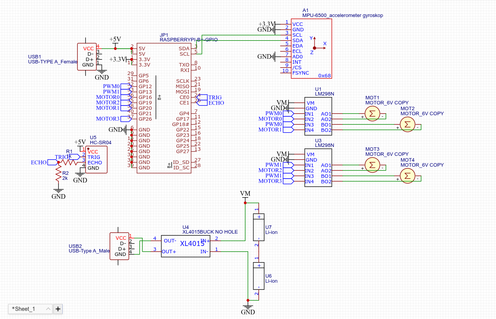
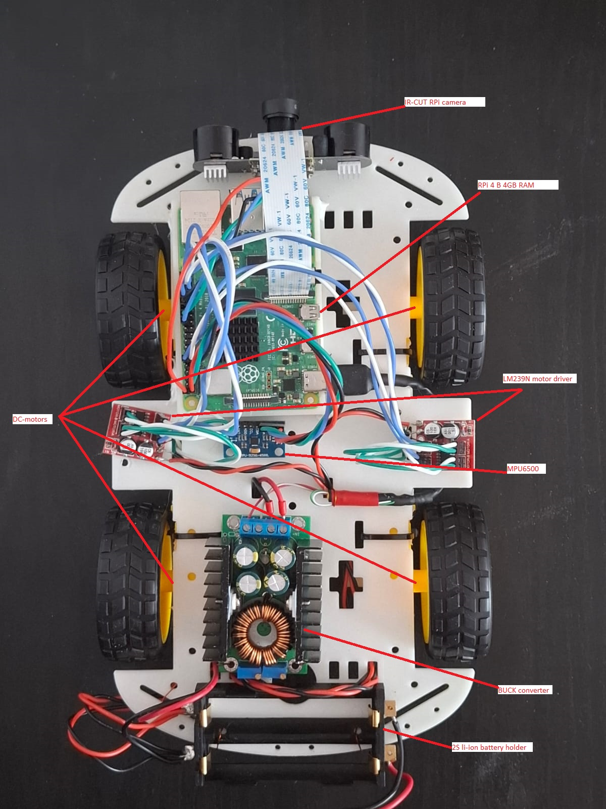

# Autonomous Vehicle
Autonomous vehicle is a robotics project (and my bachelors theses) that tries to recreate the self-driving features present on modern cars (Tesla, BYD and others), with the goal of creating a robot car capable of SAE Level 2/3 automation.

#### This project si currently under development

## Hardware

### Components used
- Raspberry Pi 4B
- Raspberry Pi compatible camera
- HC-SR04 ultrasonic distance sensor
- MPU6500 6-axis accelerometer and gyrroscope
- 2x LM298N 2 motor driver
- 4x DC motor with 48:1 gearbox and wheel
- 12A DC-DC adjustable buck converter
- 2 cell 18650 li-ion battery holder
- 2x 18650 3.6V 2600mAh li-ion battery
- 3D printed baseplate (https://www.printables.com/model/186945-4wd-buggy-chassis-arduino/files)
- cables and connectors as needed

### Wiring Schematic



### Image of the finished robot



## Installation

First flash your raspberry pi with the latest RPi OS discover its local ip on your Wi-Fi and ssh into it
```shell
ssh [RPi ip]
```

now we must configure the hardware and enable interfaces
```shell
raspi-config
# go to interfaces and enable i2c
sudo nano /boot/firmware/config.txt
# add the following line:
# dtoverlay=pwm-2chan,pin=12,func=4,pin2=13,func2=4
# now reboot
sudo reboot
```

now that the hardware is configured ssh back into your Pi, and we can install the required software build the project and run it.
```shell
sudo apt install -y build-essentials python3-picamera2 gpiod gpiod-dev git
git clone https://github.com/Cristi104/Autonomous-Vehicle
cd Autonomous-Vehicle
python3 -m venv --system-site-packages .venv
cmake --build ./cmake-build --target controller
cp cmake-build/controller.so .
sudo chmod +x run.sh
./run.sh
```

## Software

For software implementation details you can check the [docs/](docs/README.md) directory (there is just a brief overview of each part more detailed and explicit documentation will be added in the future)