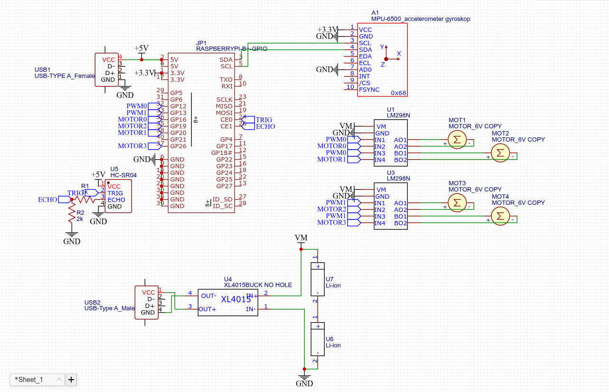
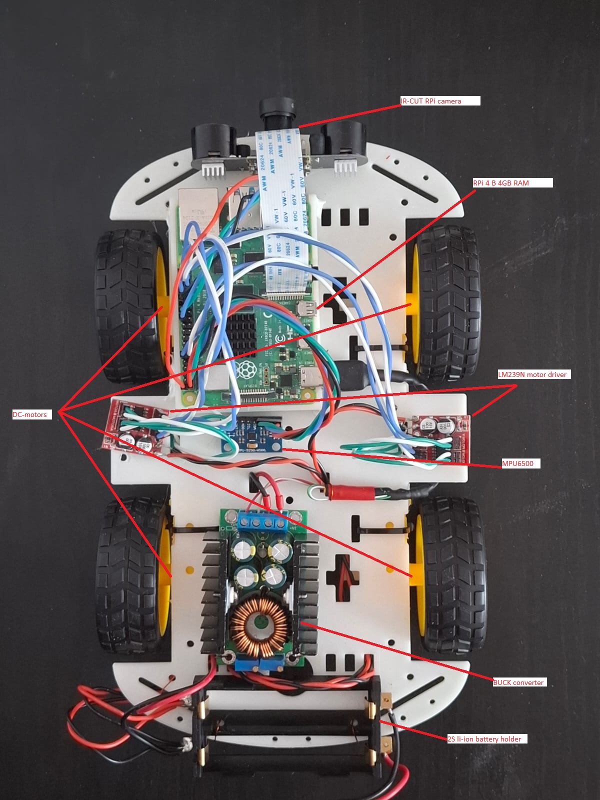

# Autonomous Vehicle
Autonomous vehicle is a robotics project (and my bachelors theses) that tries to recreate the self-driving features present on modern cars (Tesla, BYD and others), with the goal of creating a robot car capable of SAE Level 2/3 automation.

#### This project si currently under development
And this README.md is just a short overview for a more indepth explaination of the project check out my  (written only in romanin)

## Hardware

### Components used
- Raspberry Pi 4B
- Raspberry Pi compatible camera
- HC-SR04 ultrasonic distance sensor
- MPU6500 6-axis accelerometer and gyrroscope
- 2x LM298N 2 motor driver
- 4x DC motor with 48:1 gearbox and wheel
- 12A DC-DC adjustable buck converter
- 2 cell 18650 li-ion battery holder
- 2x 18650 3.6V 2600mAh li-ion battery
- 3D printed baseplate (https://www.printables.com/model/186945-4wd-buggy-chassis-arduino/files)
- cables and connectors as needed

### Wiring Schematic



### Image of the finished robot



## Installation

First flash your raspberry pi with the latest RPi OS discover its local ip on your Wi-Fi and ssh into it
```shell
ssh [RPi ip]
```

now we must configure the hardware and enable interfaces
```shell
raspi-config
# go to interfaces and enable i2c
sudo nano /boot/firmware/config.txt
# add the following line:
# dtoverlay=pwm-2chan,pin=12,func=4,pin2=13,func2=4
# now reboot
sudo reboot
```

now that the hardware is configured ssh back into your Pi, and we can install the required software build the project and run it.
```shell
sudo apt install -y build-essentials python3-picamera2 gpiod gpiod-dev git
git clone https://github.com/Cristi104/Autonomous-Vehicle
cd Autonomous-Vehicle
python3 -m venv --system-site-packages .venv
cmake --build ./cmake-build --target controller
cp cmake-build/controller.so .
sudo chmod +x run.sh
./run.sh
```

## Software

The software consists of 2 main parts written in C++ the hardware controller, and lane detector those two implement the main functionality of the robot which is then controlled through a web interface.

The hardware controller component is used as an intermediary that handles the logic of controlling the robot's motors and reading sensors independently of other parts of the app while executing stearing commands from the lane detector component.

The lane detector component applies computer vision concepts and methods such as Canny edge detection, Gaussian blur and Zhang's method for camera calibration to detect road markings in front of the robot and use the detected lane to compute stearing commands.

A last part of the project is a simple web interface that connects a remote client to the output of the camera and allows remote controll of the robot.


